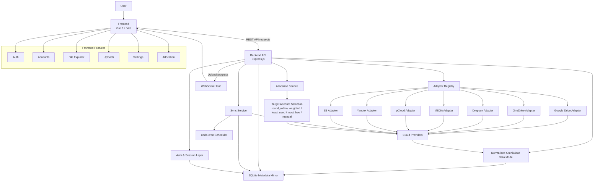

<p align="center">
  
</p>

# OmniCloud

[](https://developer.mozilla.org/en-US/docs/Web/JavaScript) [](https://vitejs.dev/) [](https://vuejs.org/) [](https://tailwindcss.com/) [](https://nodejs.org/) [](https://expressjs.com/) [](https://www.sqlite.org/) [](https://developer.mozilla.org/en-US/docs/Web/API/WebSockets_API)

OmniCloud is a full-stack cloud drive aggregation platform that presents multiple storage providers through a single, consistent workspace. The application combines a Vue-based client with an Express API and provider adapter layer, enabling users to browse, upload, download, and manage files across connected cloud accounts from one interface.


## ✨ Key features

### ☁️ Multi-provider cloud aggregation
- Connect multiple cloud storage accounts in one application
- All providers are normalized through a consistent adapter layer
- Active provider support includes OAuth, account-based login, and access-key-based connections

### 🗂️ Unified file workspace
- `Home`, `My Drive`, `Recent`, `Starred`, `Shared with Me`, and `Quota` views
- Virtual-path-based file navigation across providers
- File metadata is presented consistently across different provider sources

### 📁 File management
- Browse files and folders from connected accounts
- Create folders
- Rename files and folders
- Delete files and folders, including bulk delete
- Download provider files
- View file details and previews for supported file types
- Star / unstar files on providers that support it

### ⬆️ Upload system
- Browser-based file uploads
- Folder upload support
- Drag-and-drop uploads
- Upload session initiation through the API
- Real-time upload progress over WebSocket
- Automatic upload account allocation based on storage selection strategy

### 🔄 Sync and metadata mirror
- File metadata is stored in SQLite for fast navigation
- Account synchronization runs on a schedule using `node-cron`
- The API exposes a manual sync trigger
- Delta sync reports are available through the health/sync layer

### 👤 Auth and app modes
- `local` mode for personal or simple self-hosted usage
- `hosted` mode for multi-user deployments with session-cookie-based register/login/logout
- Account data, file mirrors, allocation config, and settings are scoped per user

### ⚙️ User settings and storage allocation
- User settings such as language and theme
- Storage allocation strategies:
  - `round_robin`
  - `weighted_round_robin`
  - `least_used`
  - `most_free`
  - `manual`
- Account priority order can be configured for the manual strategy

## Preview


## ☁️ Supported providers

| Provider | Status | Integration model |
| --- | --- | --- |
| Google Drive | Active | OAuth + Google Drive API |
| OneDrive | Active | OAuth + Microsoft Graph |
| Dropbox | Active | OAuth + Dropbox API |
| Yandex Disk | Active | OAuth + Yandex Disk API |
| MEGA | Active | Email/password account connection |
| pCloud | Active | Email/password account connection |
| S3-compatible storage | Active | Access key / secret key / endpoint based |

> Detailed provider credential setup is available in [`docs/provider-setup.md`](docs/provider-setup.md).

## 🏗️ Project structure

```text
OmniCloud/
├─ frontend/         # Vue 3 app (Vite, Pinia, Vue Router, i18n)
├─ backend/          # Express API, adapters, sync engine, SQLite
├─ docs/             # Provider setup documentation
├─ package.json      # Root workspace scripts
├─ LICENSE
└─ README.md
```

## 🔄 How OmniCloud works

At a high level:

1. The frontend calls the REST API for auth, accounts, files, uploads, settings, and allocation
2. The backend selects the appropriate provider adapter (`google_drive`, `onedrive`, `dropbox`, `mega`, `pcloud`, `yandex`, `s3`)
3. Provider responses are normalized into the OmniCloud data model
4. File metadata is mirrored into SQLite for fast access
5. Upload progress is pushed to the client over WebSocket
6. The sync service keeps local metadata aligned with provider state

## 🧩 Current application views

The frontend currently includes these main views:

- `/` → Home dashboard
- `/my-drive` → main file explorer
- `/shared-with-me` → shared files from supported providers
- `/recent` → recent files
- `/starred` → starred files
- `/quota` → quota overview, account management, allocation settings
- `/login` and `/register` → used in hosted mode

## 📋 Requirements

Before running the project, make sure you have:

- Node.js 20+
- npm
- Provider credentials for the cloud services you want to use

Using a current compatible Node.js LTS release is recommended.

## 🛠️ Local setup

### 1. Install dependencies

From the project root:

```bash
npm install
```

### 2. Create the backend environment file

Copy the env template:

```bash
copy backend/.env.example backend/.env
```

Or create it manually based on `backend/.env.example`.

### 3. Fill in the environment variables

Example environment values for the current project:

```env
PORT=8787

# local = single-user, hosted = multi-user with login/register
APP_MODE=local

CORS_ORIGIN=http://localhost:5173
FRONTEND_URL=http://localhost:5173

SYNC_INTERVAL_MINUTES=5
OMNICLOUD_SECRET_HALF=replace-this-with-random-half-key

AUTH_COOKIE_NAME=omnicloud_session
AUTH_SESSION_TTL_HOURS=336
AUTH_SECRET=replace-this-with-a-strong-random-secret

GOOGLE_CLIENT_ID=
GOOGLE_CLIENT_SECRET=
GOOGLE_REDIRECT_URI=http://localhost:8787/api/accounts/google/callback

ONEDRIVE_CLIENT_ID=
ONEDRIVE_CLIENT_SECRET=
ONEDRIVE_TENANT_ID=common
ONEDRIVE_REDIRECT_URI=http://localhost:8787/api/accounts/onedrive/callback

DROPBOX_CLIENT_ID=
DROPBOX_CLIENT_SECRET=
DROPBOX_REDIRECT_URI=http://localhost:8787/api/accounts/dropbox/callback

YANDEX_CLIENT_ID=
YANDEX_CLIENT_SECRET=
YANDEX_REDIRECT_URI=http://localhost:8787/api/accounts/yandex/callback
```

Notes:
- MEGA and pCloud do not use `.env` credentials; they are connected from the UI using email/password
- S3-compatible storage is configured from the UI using endpoint/bucket/access key/secret key
- `APP_MODE=hosted` enables the register/login/logout flow using session cookies

### 4. Configure provider credentials

Follow the detailed guide in:

- [`docs/provider-setup.md`](docs/provider-setup.md)

## 💻 Development

Run the frontend and backend together from the root:

```bash
npm run dev
```

Default local endpoints:

- Frontend: `http://localhost:5173`
- API: `http://localhost:8787`

## 🐳 Docker setup

The project includes Docker integration for running the API and production frontend behind Nginx.

### 1. Create the backend environment file

```bash
copy backend/.env.example backend/.env
```

Then fill in the provider credentials and secrets in `backend/.env`.

For the default Docker Compose setup, the app is exposed at `http://localhost:8080`, so OAuth redirect URLs should use the proxied API URLs:

```env
GOOGLE_REDIRECT_URI=http://localhost:8080/api/accounts/google/callback
ONEDRIVE_REDIRECT_URI=http://localhost:8080/api/accounts/onedrive/callback
DROPBOX_REDIRECT_URI=http://localhost:8080/api/accounts/dropbox/callback
YANDEX_REDIRECT_URI=http://localhost:8080/api/accounts/yandex/callback
```

These values are also set in `docker-compose.yml` so they override the local-development defaults from `backend/.env` when running with Compose.

### 2. Build and start the containers

```bash
docker compose up --build
```

Open the app at:

- Frontend: `http://localhost:8080`
- API through Nginx proxy: `http://localhost:8080/api`

### 3. Stop the containers

```bash
docker compose down
```

SQLite data is persisted in the Docker volume `omnicloud_api_data`. To remove containers and the persisted Docker database volume:

```bash
docker compose down -v
```

## 📌 Available scripts

### Root scripts

| Script | Description |
| --- | --- |
| `npm run dev` | Run frontend and backend in parallel |
| `npm run build` | Build the production frontend |
| `npm run build:web` | Build only the frontend |
| `npm run dev:web` | Run the Vite dev server |
| `npm run dev:api` | Run the backend with `node --watch` |
| `npm start` | Start the backend without watch mode |

### Frontend scripts

| Script | Description |
| --- | --- |
| `npm --prefix frontend run dev` | Start the Vite dev server |
| `npm --prefix frontend run build` | Build the frontend |
| `npm --prefix frontend run preview` | Preview the built frontend |

### Backend scripts

| Script | Description |
| --- | --- |
| `npm --prefix backend run dev` | Run the API with file watch |
| `npm --prefix backend start` | Run the API normally |

## 🔌 API overview

These are the main API surfaces currently present in the project.

### Health and sync
- `GET /api/health`
- `POST /api/sync/run`

### Authentication
- `GET /api/auth/me`
- `POST /api/auth/register`
- `POST /api/auth/login`
- `POST /api/auth/logout`

### Accounts
- `GET /api/accounts`
- `DELETE /api/accounts/:id`
- `GET /api/accounts/google/status`
- `GET /api/accounts/onedrive/status`
- `GET /api/accounts/dropbox/status`
- `GET /api/accounts/yandex/status`
- `GET /api/accounts/mega/status`
- `GET /api/accounts/google/connect`
- `GET /api/accounts/onedrive/connect`
- `GET /api/accounts/dropbox/connect`
- `GET /api/accounts/yandex/connect`
- `POST /api/accounts/mega/connect`
- `POST /api/accounts/pcloud/connect`
- `POST /api/accounts/s3/connect`
- OAuth callback routes under `/api/accounts/*/callback`

### Files
- `GET /api/files`
- `GET /api/files?path=/`
- `GET /api/files?recent=1`
- `GET /api/files?starred=1`
- `GET /api/files?shared=1`
- `GET /api/files/:id/shared-children`
- `PATCH /api/files/:id/star`
- `POST /api/files/bulk/delete`

> The project also includes additional file routes for file explorer operations such as details, download, rename, create folder, and per-item delete in the file service / adapter workflow.

### Uploads
- `POST /api/uploads/initiate`
- `POST /api/uploads/:uploadId/stream`
- `WS /ws/uploads?uploadId=...`

### Settings and allocation
- `GET /api/settings`
- `PATCH /api/settings`
- `GET /api/allocation`
- `PATCH /api/allocation`

## 🧠 Storage allocation behavior

When an upload starts, the backend selects the target account based on the user's allocation configuration. This allows file distribution across providers to be automatic or manually prioritized depending on the user's preference.

Example use cases:
- Distribute uploads across multiple accounts in rotation
- Prioritize the account with the most free space
- Enforce a specific manual ordering

## 🗄️ Data persistence

Important data stored locally includes:

- Mirrored file metadata in SQLite (`backend/omnicloud.db`)
- Linked account metadata
- Encrypted provider credentials / token material
- User settings
- Allocation config and rotation state
- Auth session data for hosted mode

## 🔒 Security notes

- Do not commit `backend/.env`
- Do not commit local production or personal testing database files
- OAuth client secrets, refresh tokens, session secrets, access keys, and provider passwords must be treated as sensitive
- `OMNICLOUD_SECRET_HALF` is used as part of local encryption key material
- For `APP_MODE=hosted`, use a strong `AUTH_SECRET` and the correct frontend origin

## Update 
- Added omnicloud-launcher.ps1 for simplified build launcher to exe with ps2exe
- run this command in your powershell app
```bash
Install-Module -Name ps2exe -Scope CurrentUser -Force
```
- run this command in your powershell app
```bash
Invoke-ps2exe -InputFile ".\omnicloud-launcher.ps1" -OutputFile ".\omnicloud-launcher.exe" -NoConsole -IconFile ".\icon.ico"
```

## 📄 License

This project is licensed under the [MIT License](LICENSE).
